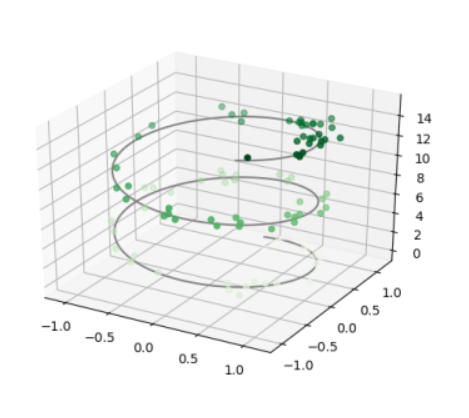
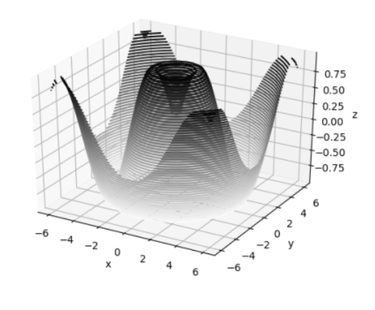
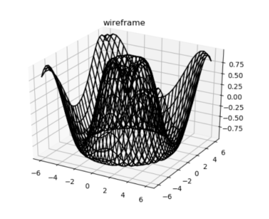
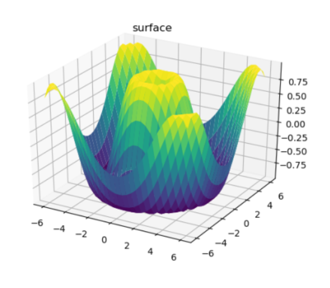

# 3D Graphs With Matplotlib

I've used two Python libraries; Matplotlib for visualization, and NumPy for building an algorithm which will help us to create and visualize graphs.

### Three-Dimensional points and lines

The most basic three-dimensional plot is a line or scatter plot created from sets of (x,y,z) triples. In analogy with more common two-dimensional plots, we can create these using the ax.plot3D and ax.scatterd3D functions. The call signature of these is nearly identical to that of their two-dimensional counterparts. Here we will plot a trigonometric spiral, along with some points drawn randomly near the line:

### Three-Dimensional contour plots

Like two-dimensional ax.contour plots, ax.contour3D requires all the input data to be in the form of two-dimensional regular grids, with the z data evaluated at each point. Here we will show a three-dimensional contour diagram of a three-dimensional sinusoidal function:

### Wireframes and Surface Plots

Two other types of three-dimensional plots that work on gridded data are wireframes and surface plots. These take a grid of values and project it onto the specified three-dimensional surface, and can make the resulting three-dimensional forms quite easy to visualize. Here’s an example using a wireframe:

A surface plot is like a wireframe plot, but each face of the wireframe is a filled polygon. Adding a colormap to the filled polygons can aid perception of the topology of the surface being visualized:

