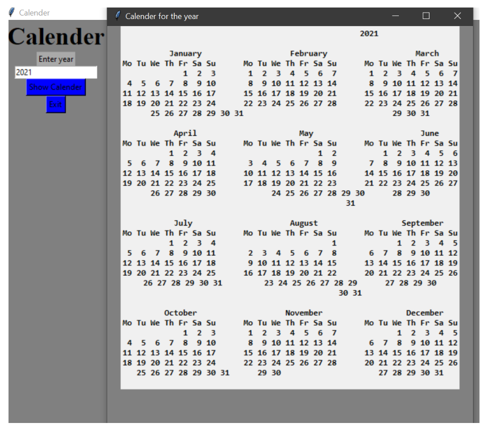

# Python GUI App For Calendar

Python provides Tkinter to develop GUI applications. Now, it’s up to the skills and imagination of the developer, what he want to develop using Tkinter. I've made a Python Calendar GUI application using Tkinter. In this application, User will have to fill the desired year, and the calendar for that specific year will appear through this application.

### Output

