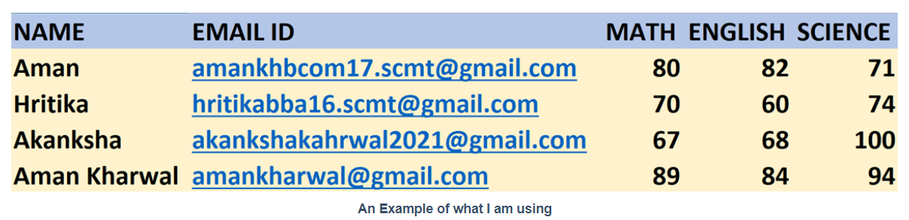

# Send Emails with Python

Sometimes we can be in a situation where we need to send emails to multiple people in a personalized way. Although these emails follow the same format, the information they contain varies from recipient to recipient.<br>
Sending emails manually takes time and there is a lot of room for error. Python allows us to automate this process very easily.

As the python script will access the Gmail account to send emails, we need to turn to Allow less secure apps to ON in this account. This will make it easier for our python program to access your account. Therefore, it is recommended to create a temporary account for this purpose.<br>

Next, to send emails with Python, we need to create a text file named template.txt. This text file contains the format of the body of the email:

```bash
Dear ${PERSON_NAME},
You have secured the following marks in your mid-term exams:
Math - ${MATH}
English - ${ENG}
Science - ${SCI}
```

Then the next file you should have is a CSV file. The file I’ll be using has the details that need to fill in the placeholders in the template file. It contains the details that should be sent to the recipients. It can be an Excel file or a CSV file.


Once the CSV file and template file are ready, now it’s time to write the code to send custom emails with python. Let’s start by importing the necessary modules:
```bash
import smtplib
import csv
from string import Template
from email.mime.multipart import MIMEMultipart
from email.mime.text import MIMEText
```
Now I will create a function to read the template.txt file. The function below returns the template object containing the contents of the template.txt file:
```bash
def read_template(filename):
   with open(filename, ‘r’, encoding=’utf-8') as template_file:
   template_file_content = template_file.read()
   return Template(template_file_content)
```
Now we need to configure the SMTP server. It is not a good practice to include the account address, password in the script if you are going to share this script with others. Instead, use input () to allow the user to enter their password when running the script:
```bash
MY_ADDRESS = *********@gmail.com  #your gmail account address
PASSWORD = ***********           #your password
s = smtplib.SMTP(host=’smtp.gmail.com’, port=587)
s.starttls()
s.login(MY_ADDRESS, PASSWORD)
```
Now the last step is to build the body of the email. For this task, we must:

- Browse the CSV file and create a message for each line of the CSV file.
- Create a message using the `MIMEMultipart ()` function, replace the details (of each line) in the template to form the body of the message, and save it in the message variable.
- Then configure parameters such as from and to address, subject of the message. Attach the message variable to the body of the message.
- Finally, send the message via the `send_message ()` function.

