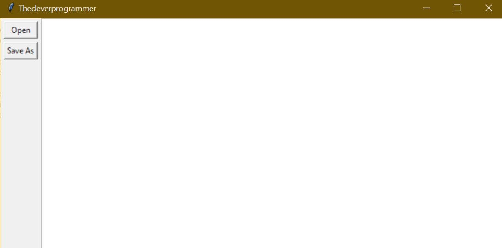

# Text Editor GUI with Python

I simply started with importing the Tkinter package and by defining the variables with respective widgets that I discussed above. If you are using the Tkinter package for the first time you don’t need to install this using any pip command, as this comes preinstalled in the Python Virtual environment. 

Now, let’s work on the layout of our text editor. First, we need to assign the buttons to the frame:

```bash
btn_open.grid(row=0, column=0, sticky="ew", padx=5, pady=5)
btn_save.grid(row=1, column=0, sticky="ew", padx=5)
```

Since we’ve assigned the buttons to the frame of our text editor, we now need to set up a grid layout for our main window:

```bash
fr_buttons.grid(row=0, column=0, sticky="ns")
txt_edit.grid(row=0, column=1, sticky="nsew")
```

Now, if you will run the code by using the window.mainloop() function the layout of our text editor GUI will be displayed.
But this is just a layout, it won’t do any task at this point. Now we need to create two functions so that we can write, save and edit using this text editor GUI.

Function to Open file:
```bash
def open_file():
    """Open a file for editing."""
    filepath = askopenfilename(
        filetypes=[("Text Files", "*.txt"), ("All Files", "*.*")]
    )
    if not filepath:
        return
    txt_edit.delete("1.0", tk.END)
    with open(filepath, "r") as input_file:
        text = input_file.read()
        txt_edit.insert(tk.END, text)
    window.title(f"Thecleverprogrammer - {filepath}")
```

Function to save file:
```bash
def save_file():
    """Save the current file as a new file."""
    filepath = asksaveasfilename(
        defaultextension="txt",
        filetypes=[("Text Files", "*.txt"), ("All Files", "*.*")],
    )
    if not filepath:
        return
    with open(filepath, "w") as output_file:
        text = txt_edit.get("1.0", tk.END)
        output_file.write(text)
    window.title(f"Thecleverprogrammer - {filepath}")
```

The above function will help us make sense with our text editor GUI. Feel free to modify this function according to your desired tasks.

### Output

