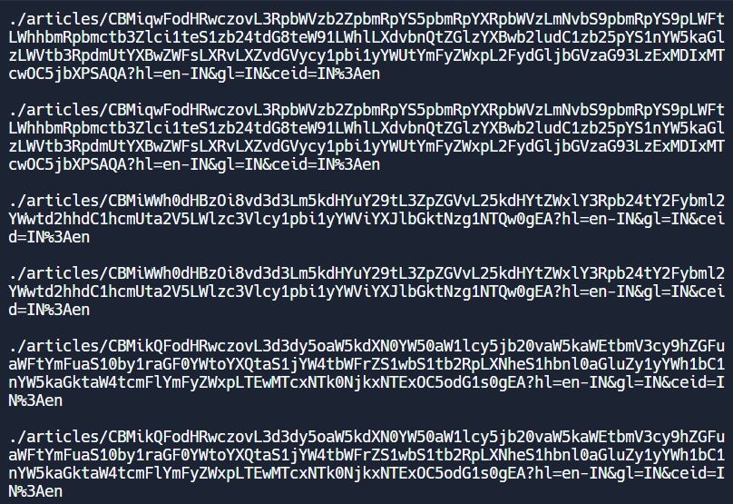

# Web Scrapper With Python

I've created a web scraper with Python that pulls all the stories from Google News by extracting all the tags from the HTML of Google News.

Google News uses tags to create links to the various websites that make up the site. So in addition to some additional data, you’ll collect all the URLs of the articles that Google News displays. I will use the BeautifulSoup module to analyze the articles from Google News.

**Installation**

Install the project dependencies:

```bash
pip install beautifulsoup4
```

Python has a built-in module, named urllib, for working with URLs. Add the following code to a new Python file:

```bash
import urllib.request
from bs4 import BeautifulSoup


class Scraper:
    def __init__(self, site):
        self.site = site
```

The `__init__` method uses a website to extract as a parameter. Later you will pass `“https://news.google.com/”` as a parameter. The Scraper class has a method called scrape that you will call whenever you want to retrieve data from the site you passed.

Add the following code to your scrape method:

```bash
def scrape(self):
        r = urllib.request.urlopen(self.site)
        html = r.read()
```

The `urlopen()` function sends a request to a website and returns a Response object in which its HTML code is stored, along with additional data. The response of the function. `read()` returns the HTML of the Response object. All the HTML for the website is in the html variable.

You are now ready to analyze the HTML. Add a new line of code in the scrape function which creates a BeautifulSoup object, and pass the html variable and the `“html.parser”` string as a parameter:

```bash
def scrape(self):
        r = urllib.request.urlopen(self.site)
        html = r.read()
        parser = "html.parser"
        sp = BeautifulSoup(html,parser)
```

The BeautifulSoup object does all the hard work and parses the HTML. You can now add code to the scrape function that calls the `find_all` method on the BeautifulSoup object.

Pass `“a”` as the parameter and the method will return all the URLs the website is linked to in the HTML code you downloaded:

```bash
def scrape(self):
        r = urllib.request.urlopen(self.site)
        html = r.read()
        parser = "html.parser"
        sp = BeautifulSoup(html,parser)
        for tag in sp.find_all("a"):
            url = tag.get("href")
            if url is None:
                continue
            if "articles" in url:
                print("\n" + url)
```
The `find_all` method returns an iterable containing the tag objects found. Each time around the for loop, the variable receives the value of a new Tag object. Each Tag object has many different instance variables, but you just want the value of the href instance variable, which contains each URL.
You can get it by calling the get method and passing `“href”` as a parameter. Finally, you verify that the URL variable contains data; that it contains the string `“articles”` (you don’t want to print internal links); and if so, you print it.

### Output


